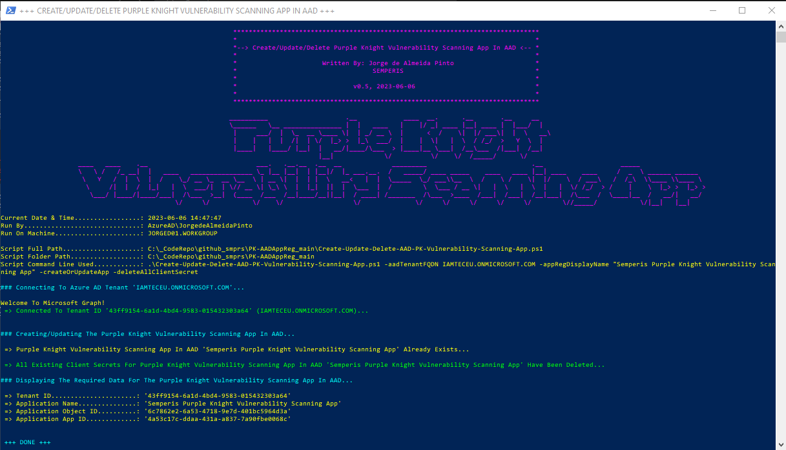
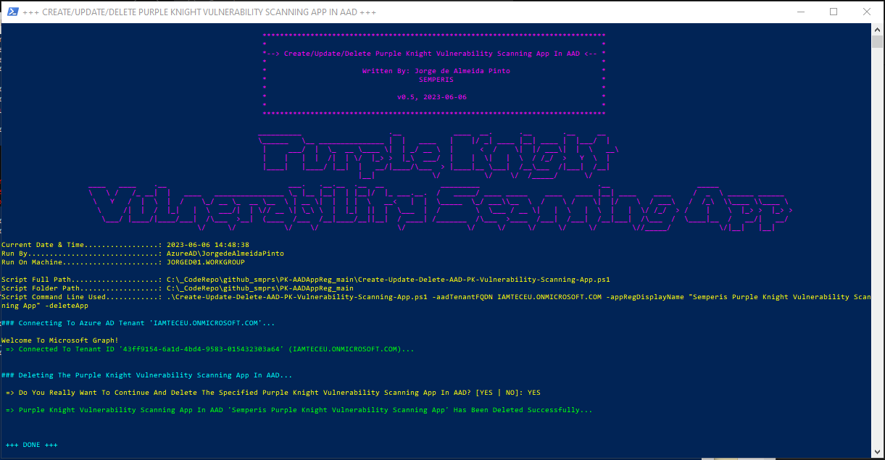
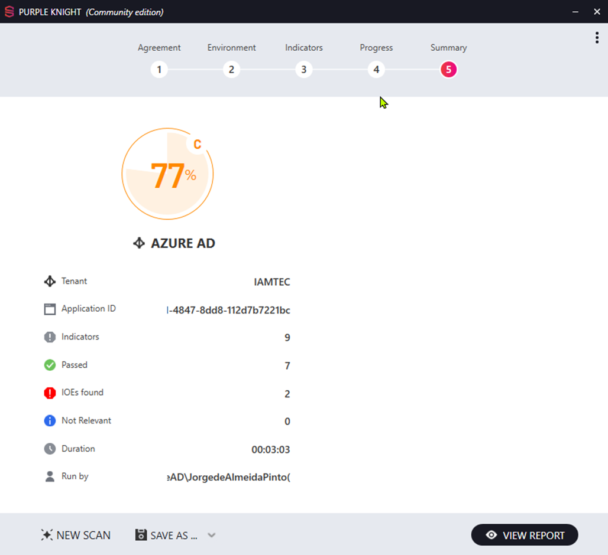

# PK-AADAppReg

## SCRIPT

See The File '[Create-Update-Delete-EID-PK-Vulnerability-Scanning-App.ps1](https://github.com/Semperis/PK-AADAppReg/blob/main/Create-Update-Delete-EID-PK-Vulnerability-Scanning-App.ps1)' Above.

----

## DESCRIPTION

This PoSH Script Creates The Application Registration In Entra ID For PK To Be Able To Scan For Vulnerabilities In Entra ID

This PoSH script provides the following functions:

* Create and update the Application Registration in Entra ID for PK To Be Able To Scan For Vulnerabilities In Entra ID;
* Delete the Application Registration in Entra ID;
* Assign the following MSFT Graph Application Permissions and consent those, when either creating or updating the app;
([System Requirements - Table 'Microsoft Entra ID connection requirements'](https://docs.purple-knight.com/community/purpleknight/pk-system-requirements.htm?tocpath=Purple%20Knight%7CPurple%20Knight%20User%20Guide%7CGetting%20Started%7C_____1))
  * AdministrativeUnit.Read.All
  * Application.Read.All
  * AuditLog.Read.All
  * Device.Read.All
  * Directory.Read.All
  * GroupMember.Read.All
  * IdentityRiskyUser.Read.All
  * Organization.Read.All
  * Policy.Read.All
  * PrivilegedAccess.Read.AzureAD
  * PrivilegedEligibilitySchedule.Read.AzureADGroup
  * Reports.Read.All
  * RoleEligibilitySchedule.Read.Directory
  * RoleManagement.Read.All
  * RoleManagement.Read.Directory
  * User.Read.All
  * UserAuthenticationMethod.Read.All
* Create an client secret that by default is valid for an hour, when either creating or updating the app. If needed it is possible to provide a customer lifetime in days for the client secret. This is not recommended as it may be a security issue;
* Deleting all client secrets from the Application Registration in Entra ID;
* Display the tenant ID, the application ID, the assigned and consented permissions, and the client secret to be used in the Purple Knight Application.

----

## REQUIREMENTS

* PowerShell 7.4 Or Higher (Because Of The Use Of The 'PSMSALNet' PowerShell Module)
* Use Of The 'PSMSALNet' PowerShell Module For Authenticating Against Entra ID [PSMSALNet Module](https://github.com/SCOMnewbie/PSMSALNet)

----

## MANDATORY PARAMETERS

* tenantFQDN => With his Parameter, You Can Specify The Tenant FQDN To Target The Entra ID Tenant To create The Application Registration In;
* appRegDisplayName => With his Parameter, You Can Specify The Name For The Application Registration;

----

## OPTIONAL PARAMETERS

* customLifetimeSecretInDays => With his Parameter, You Can Specify The Custom Lifetime Of The Client Secret In Days;

----

## PARAMETERS THAT TELL THE SCRIPT WHAT TO DO (MANDATORY)

*REMARK:* At Least ONE Of The Parameters Below Must Be Used. The Number Behind The Parameter Tells You Which Parameters Can Be Used Together

* (1) createOrUpdateApp (CAN Be Used With BOTH/EITHER '3' AND/OR '4' AND/OR '5') => With This Parameter, You Can Specify To Either Create A New Application Registration Or Update An Existing Application Registration;
* (2) deleteApp (Must Be Used Individually Only) => With This Parameter, You Can Specify To Delete An Existing Application Registration (Which Deletes The Service Principal Automatically);
* (3) updateAPIPerms (MUST Be Used With '1', CAN Be Used With '4') => With This Parameter, You Can Specify To Update The API Permissions When Either Creating A New Application Registration Or Updating An Existing Application Registration;
* (4) createClientSecret (MUST Be Used With '1', CAN Be Used With '3') => With This Parameter, You Can Specify To Create A New Client Secret When Either Creating A New Application Registration Or Updating An Existing Application Registration;
* (5) deleteAllClientSecrets (MUST Be Used With '1') => With This Parameter, You Can Specify To Delete All Existing Secrets Whether Those Are Expired Or Not (Only When App Already Exists!)
* (6) listAllClientSecrets (Must Be Used Individually Only) => With This Parameter, You Can Specify To List All Existing Client Secrets (Only When App Already Exists!)

----

## EXAMPLES

Create A Purple Knight Vulnerability Scanning App In Entra ID OR Update The Purple Knight Vulnerability Scanning App In Entra ID With Updated API Permissions And A New Client Secret (Existing Client Secrets WILL NOT Be Deleted!)

~~~~PowerShell
.\Create-Update-Delete-EID-PK-Vulnerability-Scanning-App.ps1 -tenantFQDN XXX.ONMICROSOFT.COM -appRegDisplayName "Semperis Purple Knight Vulnerability Scanning App" -createOrUpdateApp -updateAPIPerms -createClientSecret
~~~~

Update An Existing Purple Knight Vulnerability Scanning App In Entra ID With Updated API Permissions

~~~~PowerShell
.\Create-Update-Delete-EID-PK-Vulnerability-Scanning-App.ps1 -tenantFQDN XXX.ONMICROSOFT.COM -appRegDisplayName "Semperis Purple Knight Vulnerability Scanning App" -createOrUpdateApp -updateAPIPerms
~~~~

Update An Existing Purple Knight Vulnerability Scanning App In Entra ID With A New Client Secret (Existing Client Secrets WILL NOT Be Deleted!)

~~~~PowerShell
.\Create-Update-Delete-EID-PK-Vulnerability-Scanning-App.ps1 -tenantFQDN XXX.ONMICROSOFT.COM -appRegDisplayName "Semperis Purple Knight Vulnerability Scanning App" -createOrUpdateApp -createClientSecret
~~~~

List All Existing Client Secrets On The Existing Purple Knight Vulnerability Scanning App In Entra ID

~~~~PowerShell
.\Create-Update-Delete-EID-PK-Vulnerability-Scanning-App.ps1 -tenantFQDN XXX.ONMICROSOFT.COM -appRegDisplayName "Semperis Purple Knight Vulnerability Scanning App" -listAllClientSecrets
~~~~

Delete All Existing Client Secrets On The Existing Purple Knight Vulnerability Scanning App In Entra ID

~~~~PowerShell
.\Create-Update-Delete-EID-PK-Vulnerability-Scanning-App.ps1 -tenantFQDN XXX.ONMICROSOFT.COM -appRegDisplayName "Semperis Purple Knight Vulnerability Scanning App" -createOrUpdateApp -deleteAllClientSecrets
~~~~

Delete An Existing Purple Knight Vulnerability Scanning App In Entra ID

~~~~PowerShell
.\Create-Update-Delete-EID-PK-Vulnerability-Scanning-App.ps1 -tenantFQDN XXX.ONMICROSOFT.COM -appRegDisplayName "Semperis Purple Knight Vulnerability Scanning App" -deleteApp
~~~~

----

## NOTES

* Requires Microsoft Graph PoSH Module to connect to Azure AD and perform all actions, except consenting API permissions;
* Requires Az.Accounts PoSH Module to be able to consent the API permissions;
* To create, configure AND consent application permissions for the Microsoft Graph, at least membership of the "Global Administrator" built-in role is required;
* To create and configure (without assigning and consenting application permissions for the Microsoft Graph), at least membership of the "Application Administrator" or "Cloud Application Administrator" built-in role is required;
* To create a new client secret, at least application ownership is required of the existing application.

----

## SAMPLE OUTPUT 1 - PICTURE BELOW

~~~~PowerShell
.\Create-Update-Delete-EID-PK-Vulnerability-Scanning-App.ps1 -tenantFQDN XXX.ONMICROSOFT.COM -appRegDisplayName "Semperis Purple Knight Vulnerability Scanning App" -createOrUpdateApp -updateAPIPerms -createClientSecret
~~~~

* Purple Knight Vulnerability Scanning App In Entra ID DOES NOT Yet Exist
* Purple Knight Vulnerability Scanning App Will Be Created
* API Permissions Are Being Configured, And Consented
* New Short Lived Client Secret Is Being Created In Entra ID For The App And Displayed On Screen

----

## SAMPLE OUTPUT 2 - PICTURE BELOW

~~~~PowerShell
.\Create-Update-Delete-EID-PK-Vulnerability-Scanning-App.ps1 -tenantFQDN XXX.ONMICROSOFT.COM -appRegDisplayName "Semperis Purple Knight Vulnerability Scanning App" -createOrUpdateApp -updateAPIPerms -createClientSecret
~~~~

* Purple Knight Vulnerability Scanning App In Entra ID ALREADY Exists
* API Permissions Are Being Updated If Needed, And Consented
* New Short Lived Client Secret Is Being Created In Entra ID For The App And Displayed On Screen

----

## SAMPLE OUTPUT 3 - PICTURE BELOW

~~~~PowerShell
.\Create-Update-Delete-EID-PK-Vulnerability-Scanning-App.ps1 -tenantFQDN XXX.ONMICROSOFT.COM -appRegDisplayName "Semperis Purple Knight Vulnerability Scanning App" -createOrUpdateApp -createClientSecret
~~~~

* Purple Knight Vulnerability Scanning App In Entra ID ALREADY Exists
* New Short Lived Client Secret Is Being Created In Entra ID For The App And Displayed On Screen

----

## SAMPLE OUTPUT 4 - PICTURE BELOW

~~~~PowerShell
.\Create-Update-Delete-EID-PK-Vulnerability-Scanning-App.ps1 -tenantFQDN XXX.ONMICROSOFT.COM -appRegDisplayName "Semperis Purple Knight Vulnerability Scanning App" -listAllClientSecrets
~~~~

* Purple Knight Vulnerability Scanning App In Entra ID ALREADY Exists
* List The Metadata Of All Existing Client Secrets In Entra ID For The App And Displayed On Screen

----

## SAMPLE OUTPUT 5 - PICTURE BELOW

~~~~PowerShell
.\Create-Update-Delete-EID-PK-Vulnerability-Scanning-App.ps1 -tenantFQDN XXX.ONMICROSOFT.COM -appRegDisplayName "Semperis Purple Knight Vulnerability Scanning App" -createOrUpdateApp -deleteAllClientSecrets
~~~~

* Purple Knight Vulnerability Scanning App In Entra ID ALREADY Exists
* Delete All Existing Client Secrets In Entra ID For The App And Displayed On Screen

----

## SAMPLE OUTPUT 6 - PICTURE BELOW

~~~~PowerShell
.\Create-Update-Delete-EID-PK-Vulnerability-Scanning-App.ps1 -tenantFQDN XXX.ONMICROSOFT.COM -appRegDisplayName "Semperis Purple Knight Vulnerability Scanning App" -deleteApp
~~~~

* Deleting The Existing Purple Knight Vulnerability Scanning App From Entra ID

----

## SAMPLE OUTPUT 7 - PICTURE BELOW

* Purple Knight Main Screen Sample Output

