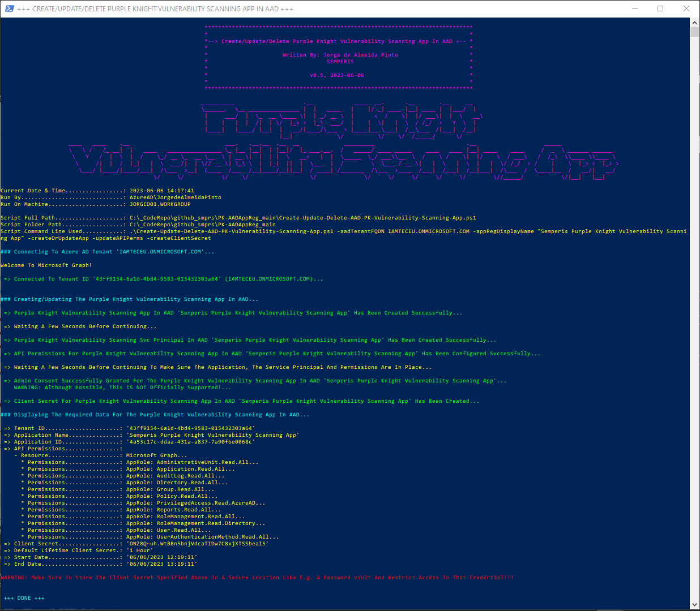

# PK-AADAppReg

## SCRIPT

See The File '[Create-Update-Delete-AAD-PK-Vulnerability-Scanning-App.ps1](https://github.com/Semperis/PK-AADAppReg/blob/main/Create-Update-Delete-AAD-PK-Vulnerability-Scanning-App.ps1)' Above.

----

## DESCRIPTION

This PoSH Script Creates The App Registration In AAD For PK To Be Able To Scan For Vulnerabilities In AAD

This PoSH script provides the following functions:

* Create and update the app registration in AAD for PK To Be Able To Scan For Vulnerabilities In AAD;
* Delete the app registration in AAD;
* Assign the following MSFT Graph Application Permissions and consent those, when either creating or updating the app;
  * AdministrativeUnit.Read.All;
  * Application.Read.All;
  * AuditLog.Read.All;
  * Directory.Read.All;
  * Group.Read.All;
  * Policy.Read.All;
  * PrivilegedAccess.Read.AzureAD;
  * Reports.Read.All;
  * RoleManagement.Read.All;
  * RoleManagement.Read.Directory;
  * User.Read.All;
  * UserAuthenticationMethod.Read.All;
* Create an client secret that by default is valid for an hour, when either creating or updating the app. If needed it is possible to provide a customer lifetime in days for the client secret. This is not recommended as it may be a security issue;
* Deleting all client secrets from the app registration in AAD;
* Display the tenant ID, the application ID, the assigned and consented permissions, and the client secret to be used in the Purple Knight executable.

----

## MANDATORY PARAMETERS

* aadTenantFQDN => With his Parameter, You Can Specify The Tenant FQDN To Target The AAD Tenant To create The App Registration In;
* appRegDisplayName => With his Parameter, You Can Specify The Name For The Application Registration;

----

## OPTIONAL PARAMETERS

* customLifetimeSecretInDays => With his Parameter, You Can Specify The Custom Lifetime Of The Client Secret In Days;

----

## PARAMETERS THAT TELL THE SCRIPT WHAT TO DO (MANDATORY)

*REMARK:* At Least ONE Of The Parameters Below Must Be Used. The Number Behind The Parameter Tells You Which Parameters Can Be Used Together

* (1) createOrUpdateApp (CAN Be Used With BOTH/EITHER '3' AND/OR '4' AND/OR '5') => With This Parameter, You Can Specify To Either Create A New App Registration Or Update An Existing App Registration;
* (2) deleteApp (Must Be Used Individually Only) => With his Parameter, You Can Specify To Delete An Existing App Registration;
* (3) updateAPIPerms (MUST Be Used With '1', CAN Be Used With '4') => With his Parameter, You Can Specify To Update The API Permissions When Either Creating A New App Registration Or Updating An Existing App Registration;
* (4) createClientSecret (MUST Be Used With '1', CAN Be Used With '3') => With his Parameter, You Can Specify To Create A New Client Secret When Either Creating A New App Registration Or Updating An Existing App Registration;
* (5) deleteAllClientSecrets (MUST Be Used With '1') => With his Parameter, You Can Specify To Delete All Existing Secrets Whether Those Are Expired Or Not (Only When App Already Exists!)

----

## EXAMPLES

Create A Purple Knight Vulnerability Scanning App In AAD

~~~~PowerShell
.\Create-Update-Delete-AAD-PK-Vulnerability-Scanning-App.ps1 -aadTenantFQDN XXX.ONMICROSOFT.COM -appRegDisplayName "Semperis Purple Knight Vulnerability Scanning App" -createOrUpdateApp -updateAPIPerms -createClientSecret
~~~~

Update An Existing Purple Knight Vulnerability Scanning App In AAD With Updated API Permissions

~~~~PowerShell
.\Create-Update-Delete-AAD-PK-Vulnerability-Scanning-App.ps1 -aadTenantFQDN XXX.ONMICROSOFT.COM -appRegDisplayName "Semperis Purple Knight Vulnerability Scanning App" -createOrUpdateApp -updateAPIPerms
~~~~

Update An Existing Purple Knight Vulnerability Scanning App In AAD With A New Client Secret (Existing Client Secrets WILL NOT Be Deleted!)

~~~~PowerShell
.\Create-Update-Delete-AAD-PK-Vulnerability-Scanning-App.ps1 -aadTenantFQDN XXX.ONMICROSOFT.COM -appRegDisplayName "Semperis Purple Knight Vulnerability Scanning App" -createOrUpdateApp -createClientSecret
~~~~

Delete All Existing Client Secrets On The Existing Purple Knight Vulnerability Scanning App In AAD

~~~~PowerShell
.\Create-Update-Delete-AAD-PK-Vulnerability-Scanning-App.ps1 -aadTenantFQDN XXX.ONMICROSOFT.COM -appRegDisplayName "Semperis Purple Knight Vulnerability Scanning App" -createOrUpdateApp -deleteAllClientSecrets
~~~~

Delete An Existing Purple Knight Vulnerability Scanning App In AAD

~~~~PowerShell
.\Create-Update-Delete-AAD-PK-Vulnerability-Scanning-App.ps1 -aadTenantFQDN XXX.ONMICROSOFT.COM -appRegDisplayName "Semperis Purple Knight Vulnerability Scanning App" -deleteApp
~~~~

----

## NOTES

* Requires AzureAD PoSH Module to connect to Azure AD and perform all actions, except consenting API permissions;
* Requires Az.Accounts PoSH Module to be able to consent the API permissions;
* To create, configure AND consent application permissions for the Microsoft Graph, at least membership of the "Global Administrator" built-in role is required;
* To create and configure (without assigning and consenting application permissions for the Microsoft Graph), at least membership of the "Application Administrator" or "Cloud Application Administrator" built-in role is required;
* To create a new client secret, at least application ownership is required of the existing application.

----

## SAMPLE OUTPUT 1 - PICTURE BELOW

~~~~PowerShell
.\Create-Update-Delete-AAD-PK-Vulnerability-Scanning-App.ps1 -aadTenantFQDN XXX.ONMICROSOFT.COM -appRegDisplayName "IAMTEC: App - Semperis Purple Knight" -createOrUpdateApp -updateAPIPerms -createClientSecret
~~~~

* Purple Knight Vulnerability Scanning App In AAD ALREADY Exists
* API Permissions Are Being Updated, And Consented
* New Short Lived Client Secret Is Being Created In AAD For The App And Displayed On Screen

----

## SAMPLE OUTPUT 2 - PICTURE BELOW

~~~~PowerShell
.\Create-Update-Delete-AAD-PK-Vulnerability-Scanning-App.ps1 -aadTenantFQDN XXX.ONMICROSOFT.COM -appRegDisplayName "IAMTEC: App - Semperis Purple Knight" -createOrUpdateApp -createClientSecret
~~~~

* Purple Knight Vulnerability Scanning App In AAD ALREADY Exists
* New Short Lived Client Secret Is Being Created In AAD For The App And Displayed On Screen

----

## SAMPLE OUTPUT 3 - PICTURE BELOW

~~~~PowerShell
.\Create-Update-Delete-AAD-PK-Vulnerability-Scanning-App.ps1 -aadTenantFQDN XXX.ONMICROSOFT.COM -appRegDisplayName "IAMTEC: App - Semperis Purple Knight" -deleteApp
~~~~

* Deleting The Existing Purple Knight Vulnerability Scanning App From AAD

----

## SAMPLE OUTPUT 4 - PICTURE BELOW

* Purple Knight Main Screen Sample Output

